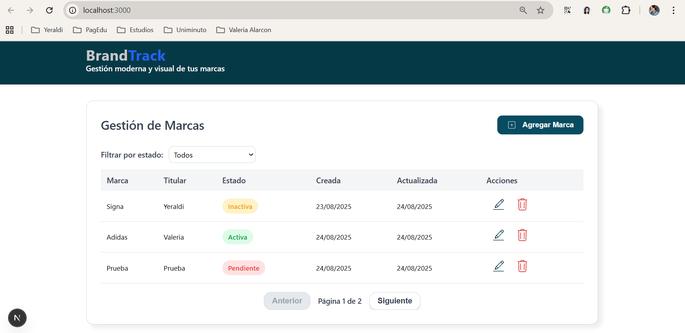
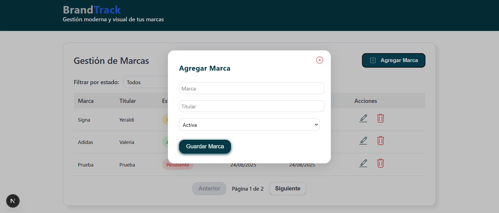
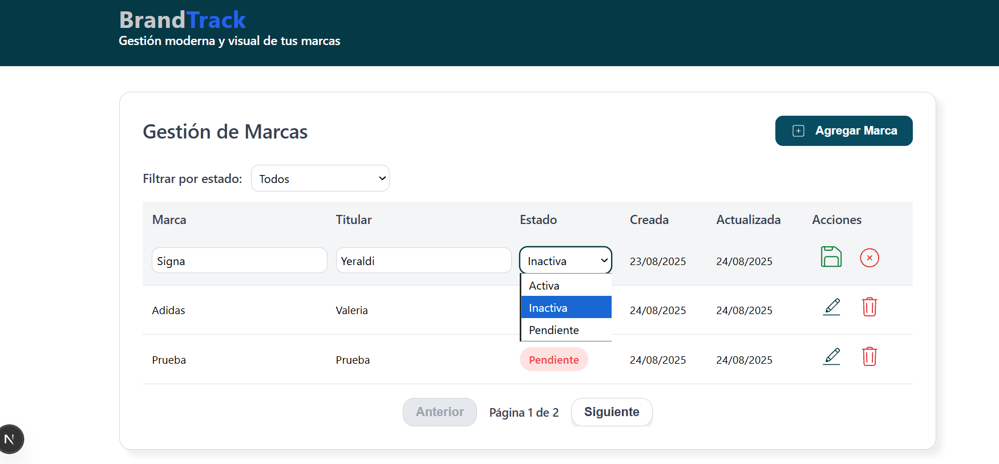
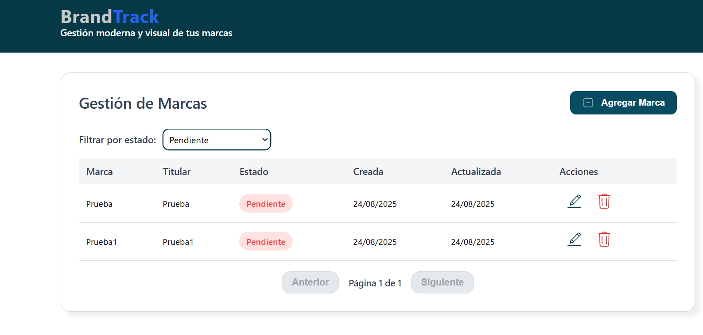

# BrandTrack - CRUD de Gestión de Marcas

BrandTrack es una aplicación **CRUD (Create, Read, Update, Delete)** desarrollada con **Next.js (frontend)** y **Django REST Framework (backend)** que que le permita al usuario ejecutar un CRUD básico para Registros de Marca.
  

## Características

- Crear nuevas marcas  
- Muestra la Lista de todas las marcas registradas  
- Permite editar la información de la marca.
- Eliminar marcas  
- Filtrar por los estados de la marca (Activa, Inactiva, Pendiente)  
- Cumple con una nterfaz amigable con el usuario  

---

## Tecnologías utilizadas

### Frontend
- [Next.js 15](https://nextjs.org/)
- CSS con estilos personalizados
- [React Icons](https://react-icons.github.io/react-icons/)

### Backend
- [Django](https://www.djangoproject.com/)
- [Django REST Framework](https://www.django-rest-framework.org/)
- SQLite

---

## Estructura del proyecto


---

## Como se instala y se ejecuta el proyecto

###  Backend (Django)
1. Clonar repositorio:
   ```bash
   git clone https://github.com/AsunaYero/brandtrack-crud.git
   cd brandtrack-crud/backend

2. Crear entorno virtual e instalar dependencias:

python -m venv venv
source venv/Scripts/activate   # En Windows: venv\Scripts\activate
pip install -r requirements.txt


3. Migrar base de datos:

python manage.py migrate


4. Ejecutar servidor:

python manage.py runserver


### Frontend (Next.js)

1. Ir a la carpeta frontend:

cd ../frontend


2. Instalar dependencias:

npm install


3. Ejecutar el servidor de desarrollo:

npm run dev


4.Abrir en navegador:  http://localhost:3000





Autora

Yeraldi Rico
Estudiante de Ingeniería de Sistemas | Desarrolladora Fullstack
🌐 GitHub
https://github.com/AsunaYero